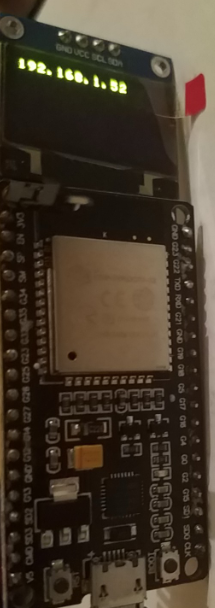

# esp32ConecctionToWiFI
After start esp32 start acces point(controller start the http server). Connect to this AP(open browser and write ip) there Write Name and Pass wifi for connection. This controller stop AP and connect to new wifi.

Test project
  	
